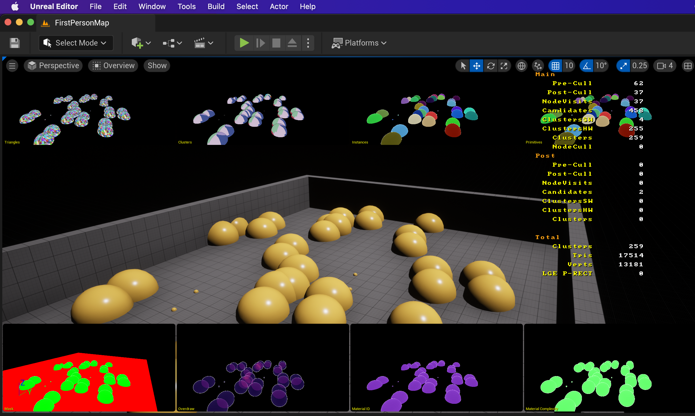

# UE5NanitePort
Run UE5 Nanite on Mac, android, iOS etc

## Run Nanite on your Mac

Perform the following steps：

1 install UE5.0.1

2 find installed directory of UE5.0.1, for example /Users/Shared/Epic\ Games/UE_5.0/Engine

3 backup binary executable files in /Users/Shared/Epic\ Games/UE_5.0/Engine/Binaries/Mac

4 replace files use downloaded files in Mac/Mac fold

5 backup shaders in /Users/Shared/Epic\ Games/UE_5.0/Engine/Shaders/Private/Nanite

6 replace shaders files use  downloaded files in Nanite fold

7 replace /Users/Shared/Epic\ Games/UE_5.0/Engine/Config/Mac/DataDrivenPlatformInfo.ini with downloaded file Mac/DataDrivenPlatformInfo.ini (just add "bSupportsNanite=true"  in ShaderPlatform METAL_SM5)

8 replace /Users/Shared/Epic\ Games/UE_5.0/Engine/Shaders/Private/ShadowDepthPixelShader.usf with downloaded file Mac/ShadowDepthPixelShader.usf

Now you can run Nanite on mac now !  Just for fun, enjoy it !

Discuss : https://www.reddit.com/r/unrealengine/comments/uwgbmt/nanite_on_mac_and_ios/

